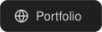
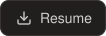
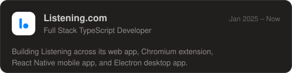
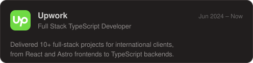
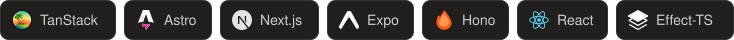
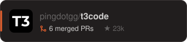
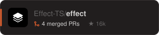

<h1 align="center"><b>Full Stack TypeScript Web Developer</b></h1>

21 y.o. · Istanbul, Turkey · from Ukraine 🇺🇦 · 3+ years professional experience

---

## Experience

## Tech Stack

<b>All skills</b>

 

**Language**

**Frontend**

**Backend**

**Infrastructure**

---

## Projects

## Contributed to

---

## GitHub Stats

