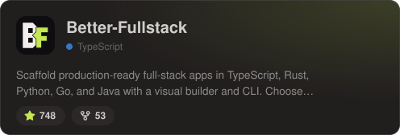
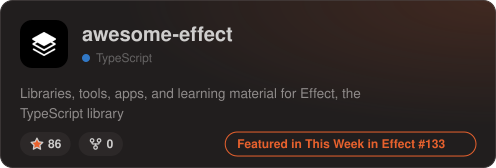
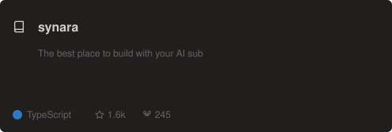
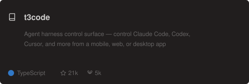
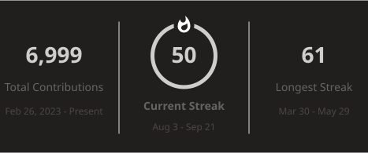
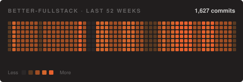

<h1 align="center"><b>Full-Stack TypeScript Web Developer</b></h1>

Odesa, Ukraine 🇺🇦 | Age: 20 | 5+ years coding | 3+ years professional experience

---

## Tech Stack

<b>Full tech stack</b>

 

**Frameworks**

**CSS / Styling**

**Tools & Libraries**

**Backend & Databases**

**Dev Tools**

---

## Projects

## Contributed to

---

## GitHub Stats

<b>More activity</b>

 

